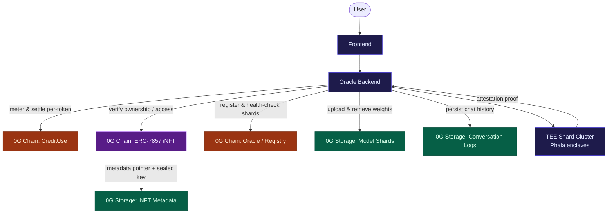
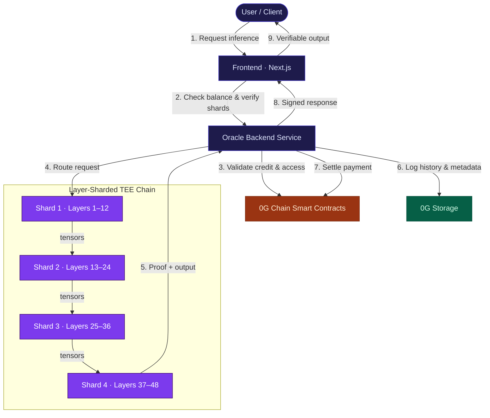
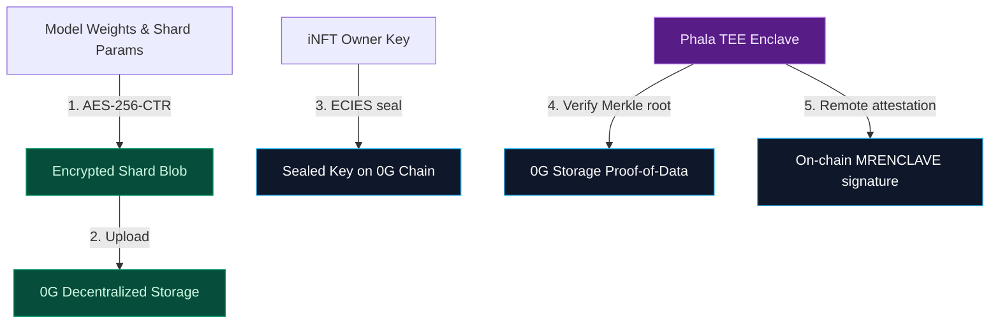
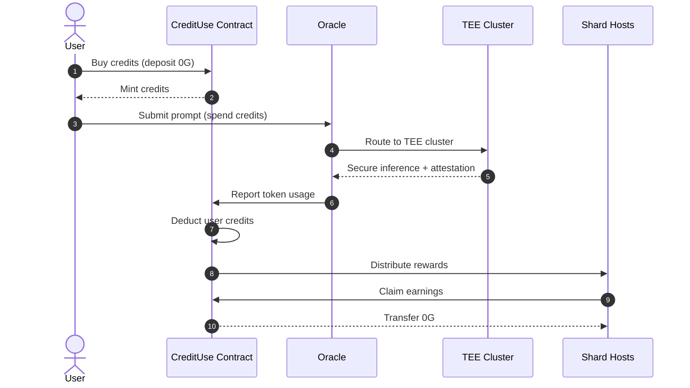

# TeeTee — Project Scoping & 0G Integration Plan

<div align="center">

**Democratizing AI through secure, verifiable, and decentralized inference — built natively on the 0G Network.**

[](https://teetee.site)
[](https://0g.ai)
[](https://chainscan.0g.ai)
[](https://0g.ai)

[Live Demo](https://teetee.site) · [Technical Paper](https://docs.google.com/document/d/1D_g_0f35Rdzx2W_6PkjKKRscLBLe_7QvbgQBehHOtR4/edit?tab=t.0) · [Documentation](https://docs.google.com/document/d/1pqDrJoYoBfVG19Kxu0-9uSHfwEq3ZQjp8d1CU9Pd-Kk/edit?usp=sharing) · [Video Demo](https://drive.google.com/drive/folders/1eWDgBJ_o2jr5xT2U_ZYclxhAAt15G4HJ?usp=sharing)

</div>

---

> **How to read this document.** It is written for a mixed audience — the 0G Labs evaluation team, technical developers, and both technical and non-technical investors. Strategy and business sections come first; technical deep-dives follow. Throughout, technical sections include a short **🟢 In plain terms** note so every reader can follow the full story. Every major claim is anchored to **work that is already deployed and verifiable on 0G mainnet** — this is a shipped product, not a proposal.

---

## 📋 Table of Contents

1. [Executive Summary](#1-executive-summary)
2. [The Problem We Solve](#2-the-problem-we-solve)
3. [What TeeTee Is (Project Definition)](#3-what-teetee-is-project-definition)
4. [Why 0G — Strategic Fit](#4-why-0g--strategic-fit)
5. [Target 0G Components & Integration Map](#5-target-0g-components--integration-map)
6. [System Architecture](#6-system-architecture)
7. [Technical Deep-Dive](#7-technical-deep-dive)
8. [Deployment Status & On-Chain Proof](#8-deployment-status--on-chain-proof)
9. [Credit Economy & Business Model](#9-credit-economy--business-model)
10. [Market Opportunity](#10-market-opportunity)
11. [Impact on the 0G Ecosystem](#11-impact-on-the-0g-ecosystem)
12. [Traction & Validation](#12-traction--validation)
13. [0G Integration Roadmap (Phased Plan)](#13-0g-integration-roadmap-phased-plan)
14. [Risks & Mitigations](#14-risks--mitigations)
15. [What We're Seeking](#15-what-were-seeking)
16. [Appendix — Glossary & References](#16-appendix--glossary--references)

---

## 1. Executive Summary

**TeeTee is a decentralized AI inference network that lets anyone run large language models privately, verifiably, and at roughly one-tenth of the cost of self-hosting — by splitting models layer-by-layer across hardware-isolated Trusted Execution Environments (TEEs) and settling everything on the 0G Network.**

Today, high-performance AI forces an uncomfortable trade-off: send your data to a centralized provider and lose privacy, or spend $100K+ on your own GPU cluster. TeeTee removes that trade-off. Models are sharded across multiple TEE nodes; each node holds only a fragment of the model and only ever sees encrypted intermediate tensors — never raw prompts or full weights. Ownership and access are governed on-chain through the **ERC-7857 Intelligent NFT (iNFT)** standard, model weights and chat history are stored on **0G Storage**, and every inference is metered and settled per-token on **0G Chain**.

| | |
|---|---|
| **What it is** | Decentralized, privacy-preserving LLM inference via layer-sharded TEEs |
| **Current status** | **Live in production** at [teetee.site](https://teetee.site) — core contracts deployed and verified on **0G mainnet** |
| **0G components used** | 0G Chain · 0G Storage · ERC-7857 iNFT · 0G-TS-SDK (with 0G Compute on the roadmap) |
| **Models served** | DeepSeek V3, Llama 3.3 (with GPT-OSS, Qwen supported) |
| **Headline value** | ~**10x cost reduction** vs. self-hosting, with hardware-grade privacy and on-chain verifiability |
| **Origin** | 0G WaveHack Wave 5 submission — backed by original, self-authored research |

> 🟢 **In plain terms:** TeeTee is like a peer-to-peer Airbnb for AI compute. Instead of one company owning a giant, expensive AI model, many participants each host a small piece. Users get full access to a powerful model, hosts earn money, and — crucially — nobody can read your data or steal the model, because everything runs inside sealed, tamper-proof hardware and is verified on the 0G blockchain.

---

## 2. The Problem We Solve

Modern AI is powerful but structurally centralized, creating three compounding problems:

| Problem | Consequence |
|---|---|
| **🚨 Privacy loss** | Using OpenAI/Anthropic means shipping sensitive prompts to third-party servers. Healthcare, legal, and financial organizations legally *cannot* do this for much of their data. |
| **💸 Prohibitive cost** | Self-hosting a frontier model requires $100K+ in GPUs plus ongoing ops. A 70B+ parameter model needs 140GB+ of memory — beyond a single affordable node. |
| **❓ Zero verifiability** | With centralized APIs you must *trust* that the advertised model ran, that your data wasn't retained, and that the output wasn't tampered with. There is no cryptographic proof. |

The result: most teams settle for weaker models, or accept privacy and cost risks they would rather not. **The market is forced to choose between privacy and price. TeeTee refuses that choice.**

---

## 3. What TeeTee Is (Project Definition)

TeeTee is a **layer-sharded, TEE-secured, on-chain-settled AI inference network**. Three ideas combine into one product:

**1. Layer Sharding.** A large model is split by layers and distributed across several TEE nodes. A request flows through the chain of shards; each shard computes its layers and passes only the intermediate activation tensor to the next.

```
Example: a 48-layer model split across 4 hosts
   User Query → TEE Shard 1 (Layers 1–12) → TEE Shard 2 (Layers 13–24)
              → TEE Shard 3 (Layers 25–36) → TEE Shard 4 (Layers 37–48) → Response
```

- Each host funds only **one shard** (~$10K) instead of the whole model (~$100K).
- Models can scale **beyond the memory of any single node** (run 70B+ models on commodity hardware).
- Only abstract activation matrices cross the wire — **never raw text or full weights**.

**2. Trusted Execution Environments (TEEs).** Every shard runs inside a hardware-isolated enclave (Phala TEE). The enclave proves, via remote attestation, that the correct model code executed on the correct weights — and that nobody, not even the host machine's operator, could inspect the data.

**3. On-Chain Ownership & Settlement (0G).** Model ownership is represented as an **ERC-7857 iNFT**; encrypted weights and chat history live on **0G Storage**; and usage is metered and paid per-token through smart contracts on **0G Chain**.

> 🟢 **In plain terms:** Think of a model as a long assembly line. TeeTee gives each worker (host) one section of the line, sealed in a soundproof, locked booth (the TEE). Work passes down the line as coded parcels nobody can open, the final product comes out the end, and the blockchain keeps an honest, public receipt of who did what and who gets paid.

---

## 4. Why 0G — Strategic Fit

TeeTee is not "an app that happens to use a blockchain." It requires a specific combination of **high-throughput storage, low-cost high-frequency settlement, and a native intelligent-asset standard** — and the 0G Network is the only stack that provides all three together.

| Requirement | Why TeeTee needs it | What 0G provides |
|---|---|---|
| **Massive, fast, cheap storage** | Model shards are gigabytes; nodes must load/verify/swap them instantly | **0G Storage** — ~2 GB/s throughput at **~$10/TB** (vs. $1,000+/TB on traditional clouds) |
| **High-frequency micro-settlement** | Pay-per-token billing implies thousands of tiny on-chain transactions | **0G Chain** — 2,500+ TPS, sub-second finality, low fees |
| **Native AI-asset ownership** | Models, agents, and their metadata must be ownable, transferable assets | **ERC-7857 iNFT** standard on 0G — secure, encrypted metadata transfer |
| **EVM compatibility** | Reuse the Web3 tooling and wallet ecosystem | 0G is a fully **EVM-compatible Layer 1** |

> 🟢 **In plain terms:** AI files are huge and AI usage happens constantly. Most blockchains are too slow, too expensive, or can't store large files. 0G was purpose-built for AI — it stores big files cheaply, settles payments fast, and natively understands AI as an ownable asset. That is exactly the foundation TeeTee stands on.

---

## 5. Target 0G Components & Integration Map

This is the heart of our integration. The table below maps **each 0G component to its concrete role in TeeTee**, with honest status labels so reviewers can distinguish what is shipped from what is planned.

| 0G Component | Role in TeeTee | What it stores / settles | Status |
|---|---|---|---|
| **🟢 0G Chain** (EVM L1) | Settlement, metering, ownership & registry layer | Credit purchases, per-token deductions, hoster payouts, iNFT mint/transfer, shard registry & hashes | **Live on mainnet** |
| **🟢 0G Storage** | Decentralized storage for large AI artifacts | Encrypted model-shard weights, encrypted chat history, iNFT metadata | **Live** (mainnet upload proof on-chain) |
| **🟢 ERC-7857 iNFT** | Intelligent-NFT ownership & secure metadata transfer | Sealed decryption keys + pointers to weights on 0G Storage; oracle/TEE re-encryption on transfer | **Live & verified on mainnet** |
| **🟢 0G-TS-SDK** | Developer integration into storage & chain from the oracle/backend | Programmatic upload, Merkle-proof verification, retrieval | **Integrated** |
| **🟠 0G Compute Network** | Permissionless settlement & routing with compute providers | Provider discovery and settlement for inference jobs | **Roadmap — deepening** |

**Integration data-flow (which component handles what):**



> 🟢 **In plain terms:** 0G Chain is the cash register and the property deed. 0G Storage is the warehouse for the heavy AI files. The iNFT is the title of ownership for each AI model. Together they let TeeTee run a real business — secure storage, provable ownership, and instant payments — without a central company in the middle.

---

## 6. System Architecture

TeeTee connects decentralized TEE clusters, high-speed 0G Storage, and 0G Chain smart contracts to coordinate secure, layer-sharded execution.



### Component Breakdown

| Component | Purpose | Core Tech |
|---|---|---|
| **Frontend** | User & host interface: inference console, model marketplace, hoster dashboard, wallet flows | Next.js 16, React 19, Tailwind, ethers.js, RainbowKit/wagmi |
| **Oracle Backend** | Bridges off-chain TEE compute with on-chain logic: health checks, shard lifecycle, model-hash verification, inference routing, failover | Node.js, TypeScript, Express, ethers.js, **0G-TS-SDK** |
| **Smart Contracts** | Credit metering, settlement, subscriptions | Solidity (Cancun), Hardhat, **0G Chain** |
| **0G iNFT (ERC-7857)** | AI-agent ownership, access control, secure metadata transfer | INFT.sol / INFTFixed.sol / OracleStub.sol |
| **LLM / TEE Server** | OpenAI-compatible inference inside confidential hardware | Phala Cloud GPU TEE, multi-model support |

> 🟢 **In plain terms:** A user asks a question on the website. The system checks they've paid, routes the question through the chain of sealed AI booths, collects a cryptographic "proof of honest work," saves the conversation to decentralized storage, pays the hosts automatically, and returns a verified answer — all in seconds.

---

## 7. Technical Deep-Dive

### 7.1 Layer Sharding (the core idea)

A model `M` is a composition of `L` layers: `M(x) = f_L(f_{L-1}(…f_1(x)…))`. TeeTee partitions the layers into `N` contiguous shards `S_1 … S_N`. During inference, the client sends input `a_0 = x` to Shard 1; each shard computes `a_i = S_i(a_{i-1})` and forwards the activation `a_i` to the next shard; the final shard outputs token probabilities `y = a_N`.

Because the intermediate states `a_i` are abstract activation matrices (embeddings) rather than human-readable text, **no private data or full model weights are ever exposed in transit.**

### 7.2 Cryptographic Trust Stack



| Layer | Mechanism | Guarantee |
|---|---|---|
| **Confidentiality at rest** | Shard weights encrypted with **AES-256-CTR**; key sealed with **ECIES** to the TEE's public key, stored in iNFT metadata | Weights are useless without the enclave |
| **Integrity of data** | TEE verifies **Merkle inclusion proofs** against on-chain hashes when fetching from 0G Storage | Downloaded files provably match what was registered |
| **Verifiable execution** | Phala TEE emits a **remote attestation (SgxQuote)** per request | Proof that the exact model ran inside isolated hardware |

> 🟢 **In plain terms:** The model is locked in an encrypted vault, the only key is sealed to a tamper-proof chip, and that chip signs a receipt proving it ran the real model on the real data. If anything were swapped or snooped, the math wouldn't add up — and the blockchain would show it.

---

## 8. Deployment Status & On-Chain Proof

TeeTee is **not a whitepaper concept** — it is deployed and independently verifiable on 0G block explorers today.

### Verified 0G Mainnet Contracts

| Contract | Address | Purpose |
|---|---|---|
| **CreditUse** | [`0xd1ce92b2c95a892fe1166e20b65c73b33b269f7e`](https://chainscan.0g.ai/address/0xd1ce92b2c95a892fe1166e20b65c73b33b269f7e?tab=contract-viewer) | Credit management & usage metering |
| **OracleStub** | [`0x20f8f585f8e0d3d1fce7907a3c02aeaa5c924707`](https://chainscan.0g.ai/address/0x20f8f585f8e0d3d1fce7907a3c02aeaa5c924707?tab=contract-viewer) | Oracle / health-check interface |
| **DataVerifierAdapterFixed** | [`0x8889106de495dc1731a9b60a58817de6e0142ac0`](https://chainscan.0g.ai/address/0x8889106de495dc1731a9b60a58817de6e0142ac0?tab=contract-viewer) | Data verification adapter |
| **INFT (ERC-7857)** | [`0x56776a7878c7d4cc9943b17d91a3e098c77614da`](https://chainscan.0g.ai/address/0x56776a7878c7d4cc9943b17d91a3e098c77614da?tab=contract-viewer) | Intelligent NFT for AI agents |

### Mainnet Transaction Proofs

| Event | Transaction |
|---|---|
| **0G Storage upload** (chat history) | [`0x183d6cdc…05df932f`](https://chainscan.0g.ai/tx/0x183d6cdc0e5ce2e3174e36a5842411208ff8334df560dd2dcc8c222f05df932f) |
| **iNFT minting** | [`0x3e8144b2…6da6535d`](https://chainscan.0g.ai/tx/0x3e8144b2d355ccbac0f86371966c0903e46b0099bc0207c5923834c26da6535d) |
| **Register LLM** | [`0x3350f908…22fbcba4`](https://chainscan.0g.ai/tx/0x3350f908d68a4afddb2f5d6fc3a35ecf135d1059eac0cdd4db45b8fa22fbcba4) |

### Galileo Testnet (active development)

| Contract | Address |
|---|---|
| CreditUse | `0x279F92C0a07A8cfb6d7c01b0BBc9597377587c58` |
| Subscription | `0x235dAa4De0aBaFbbAb9d8Bded08d1361B872C62e` |
| OracleStub | `0x4d1b86b480A68A93C75b9D339f439c6FA2E5241d` |
| DataVerifierAdapterFixed | `0x6181b28d49Ed9c10824A3552EF674bD33ff6AA4B` |
| INFT (ERC-7857) | `0x16d0B91b1d67AaDF673F50D423c472ec9f32378b` |

**Network reference:** 0G Mainnet — Chain ID `16661`, RPC `https://evmrpc.0g.ai` · 0G Galileo Testnet — Chain ID `16602`, RPC `https://evmrpc-testnet.0g.ai`.

> 🟢 **In plain terms:** Anyone — including you, right now — can click these links and see TeeTee's live contracts and real transactions on 0G's public explorer. The product works and is running on mainnet.

---

## 9. Credit Economy & Business Model

TeeTee replaces opaque subscriptions with a transparent, **pay-per-token** settlement lifecycle on 0G Chain.



| Stakeholder | Value | How they pay / earn |
|---|---|---|
| **Users** | Premium models, privacy, transparent costs | Pay-per-token (e.g., 0.001 0G ≈ 200 credits); withdraw unused credits anytime |
| **Hosts** | Passive income from idle/owned hardware | Earn automatically when their shard serves a request |
| **Platform** | Sustainable protocol fee on settlement | A small margin on metered usage |

**Revenue scales with usage, not seats** — every query is an on-chain settlement, aligning protocol revenue directly with network activity.

> 🟢 **In plain terms:** Users pay only for exactly what they use, hosts get paid the instant their slice does work, and it's all on a public ledger. No surprise bills, no lock-in, no middleman skimming in the dark.

---

## 10. Market Opportunity

- **Enterprise private AI.** Healthcare, legal, and financial firms are legally and competitively blocked from sending data to public LLM APIs, yet cannot justify $100K+ private GPU clusters. TeeTee gives them **enterprise-grade privacy at consumer prices** — turning a blocked buyer into an active one.
- **The AI-agent economy.** ERC-7857 iNFTs make AI models and agents *ownable, tradable, licensable assets*. This unlocks marketplaces, rentals, and royalties for AI — a category that simply cannot exist on chains without cheap large-file storage.
- **Global accessibility.** Pay-per-token micro-billing lets researchers, startups, and developers in cost-sensitive regions access frontier models for pennies.

TeeTee positions itself as the **infrastructure layer** beneath all three — not a single app, but the rails others build on.

---

## 11. Impact on the 0G Ecosystem

TeeTee is engineered to be a **demand engine for 0G**, not just a consumer of it:

| Driver | Effect on 0G |
|---|---|
| **Storage demand** | Every deployment stores GBs of model weights + chat history on **0G Storage** → sustained storage revenue |
| **On-chain activity** | Every inference = a credit transaction on **0G Chain** → continuous transaction volume & fee generation |
| **TVL** | Users purchase and hold credits in 0G smart contracts → locked value grows with adoption |
| **Developer onboarding** | Teams building on TeeTee adopt the **0G-TS-SDK** and 0G contracts → expands the 0G developer base |
| **Flagship use case** | A privacy + cost story that Web2 AI can't match → a marquee reason for enterprises to come to 0G |

> 🟢 **In plain terms:** The more TeeTee grows, the more storage, transactions, and locked value flow into 0G. We're aiming to be a showcase that brings *real businesses* onto the 0G Network.

---

## 12. Traction & Validation

| Proof point | Link |
|---|---|
| **Live production app** | [teetee.site](https://teetee.site) |
| **Mainnet-deployed & verified contracts** | See [Section 8](#8-deployment-status--on-chain-proof) |
| **Original research / technical paper** | [LLM Sharding in TEE](https://docs.google.com/document/d/1D_g_0f35Rdzx2W_6PkjKKRscLBLe_7QvbgQBehHOtR4/edit?tab=t.0) |
| **Documentation** | [Comprehensive guide](https://docs.google.com/document/d/1pqDrJoYoBfVG19Kxu0-9uSHfwEq3ZQjp8d1CU9Pd-Kk/edit?usp=sharing) |
| **Demo video** | [Wave 5 demo](https://drive.google.com/drive/folders/1eWDgBJ_o2jr5xT2U_ZYclxhAAt15G4HJ?usp=sharing) |
| **Building-in-public threads** | [1](https://x.com/ilovedahmo/status/1986064335354126573) · [2](https://x.com/derek2403/status/1986100026100322593) · [3](https://x.com/marcustan1337/status/1986066934362943503) · [4](https://x.com/avoisavo/status/1986130154222199032) · [5](https://x.com/honzz_0116/status/1986279319338164368) |

We built and shipped this during **0G WaveHack Wave 5**, documenting milestones publicly throughout.

---

## 13. 0G Integration Roadmap (Phased Plan)

Each phase deepens our use of 0G primitives. Timelines are directional targets.

| Phase | Focus | 0G integration milestones |
|---|---|---|
| **Phase 1 — Beta → GA** | Harden the live product; broaden model catalog | Production traffic settling on **0G Chain**; weights + history on **0G Storage** at scale |
| **Phase 2 — Model Ecosystem** | More models, larger shards, host onboarding | iNFT-based model marketplace; expanded **0G Storage** footprint per model |
| **Phase 3 — Decentralization & Security** | Trust-minimize the oracle; richer attestation | Tighter Merkle-proof verification loops; broader on-chain proof anchoring |
| **Phase 4 — Enterprise & Scale** | Compliance, SLAs, enterprise onboarding | Audit-grade usage logs on **0G Storage**; high-frequency settlement on **0G Chain** |
| **Phase 5 — Decentralized AI Infrastructure** | Open network of hosts and models | Permissionless routing/settlement via **0G Compute Network** |

> 🟢 **In plain terms:** We already use 0G heavily today. The plan is to lean on it even more over time — more storage, more on-chain settlement, and eventually fully permissionless compute — so TeeTee and 0G grow together.

---

## 14. Risks & Mitigations

We believe credibility comes from naming risks openly, not hiding them.

| Risk | Mitigation |
|---|---|
| **Latency from sequential shards** | Pipelined activation passing; route to healthy/fast endpoints; co-locate shards where possible |
| **Oracle centralization (today)** | Health-check + verification logic is on-chain-anchored; Phase 3/5 progressively decentralize routing toward **0G Compute** |
| **Host reliability / churn** | Automated health checks, failover rerouting, and iNFT-gated activation suspend unhealthy nodes |
| **TEE trust assumptions** | Hardware remote attestation per request + Merkle proofs; defense-in-depth rather than single-point trust |
| **Key & secret management** | Secrets are environment-scoped and git-ignored; keys are sealed via ECIES to enclave public keys, never exposed in transit |
| **Regulatory / compliance** | On-chain, auditable usage logs on 0G Storage support enterprise compliance needs (e.g., SOC2/ISO evidence trails) |

> 🟢 **In plain terms:** No serious infrastructure is risk-free. We've identified the hard parts — speed, decentralization, trust, security — and have concrete, staged answers for each.

---

## 15. What We're Seeking

> *The specifics below are intentionally left for the team to tailor per conversation.*

**From the 0G Labs team:**
- Continued ecosystem support and technical collaboration (storage, compute, and iNFT roadmap alignment).
- Co-marketing TeeTee as a flagship private-AI use case on 0G.
- Early access and feedback channels for upcoming **0G Compute Network** capabilities.

**From investors / partners:**
- Strategic capital to scale the host network, expand the model catalog, and harden enterprise readiness.
- Introductions to enterprise design partners in privacy-sensitive sectors (healthcare, legal, finance).
- Partnership on go-to-market for the AI-agent / iNFT marketplace.

**Engage with us:** [teetee.site](https://teetee.site) · [GitHub Issues](https://github.com/Ritik200238/TeeTee/issues)

---

## 16. Appendix — Glossary & References

**Glossary (for non-technical readers):**

| Term | Meaning |
|---|---|
| **TEE** | Trusted Execution Environment — a sealed, tamper-proof region of a chip where code runs privately and can prove what it did. |
| **Layer sharding** | Splitting an AI model into sequential pieces ("layers") hosted on different machines. |
| **iNFT (ERC-7857)** | An "Intelligent NFT" — an on-chain token that owns an AI model/agent and its encrypted data. |
| **Attestation** | A cryptographic receipt proving a specific program ran inside a genuine TEE. |
| **Merkle proof** | A compact cryptographic proof that a file matches a known fingerprint — used to verify downloads. |
| **ECIES / AES-256** | Encryption methods used to lock the model and seal its keys. |
| **0G Storage / 0G Chain** | 0G's decentralized file storage and its high-speed blockchain settlement layer. |

**Key references:**
- Live App — https://teetee.site
- Technical Paper — *LLM Sharding in TEE*
- 0G Mainnet Explorer — https://chainscan.0g.ai
- Repository — https://github.com/Ritik200238/TeeTee

---

<div align="center">

**TeeTee — bringing private, verifiable, affordable AI to the world, on 0G.**

*Built with conviction during 0G WaveHack Wave 5.*

</div>
